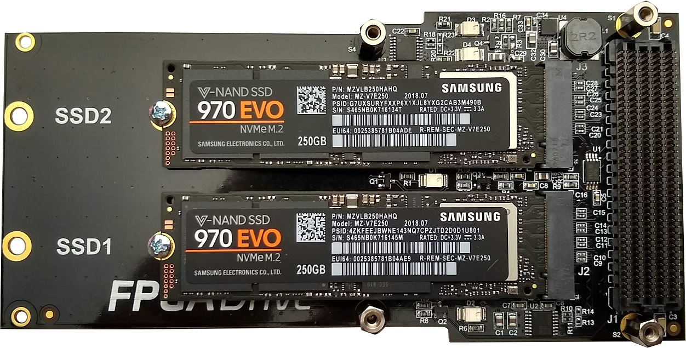

FPGA Drive FMC Reference Designs
================================

## Description

This repo contains the example designs for the FPGA Drive FMC mated with several FPGA and MPSoC evaluation boards.

## Requirements

This project is designed for version 2020.2 of the Xilinx tools (Vivado/Vitis/PetaLinux). 
If you are using an older version of the Xilinx tools, then refer to the 
[release tags](https://github.com/fpgadeveloper/fpga-drive-aximm-pcie/releases "releases")
to find the version of this repository that matches your version of the tools.

In order to test this design on hardware, you will need the following:

* Vivado 2020.2
* Vitis 2020.2
* PetaLinux Tools 2020.2
* [FPGA Drive](http://fpgadrive.com "FPGA Drive") - for connecting a PCIe SSD
* M.2 PCIe Solid State Drive
* One of the supported carriers listed below

## Contribute

We encourage contribution to these projects. If you spot issues or you want to add designs for other platforms, please
make a pull request.

### About us

This project was developed by [Opsero Inc.](http://opsero.com "Opsero Inc."),
a tight-knit team of FPGA experts delivering FPGA products and design services to start-ups and tech companies. 
Follow our blog, [FPGA Developer](http://www.fpgadeveloper.com "FPGA Developer"), for news, tutorials and
updates on the awesome projects we work on.