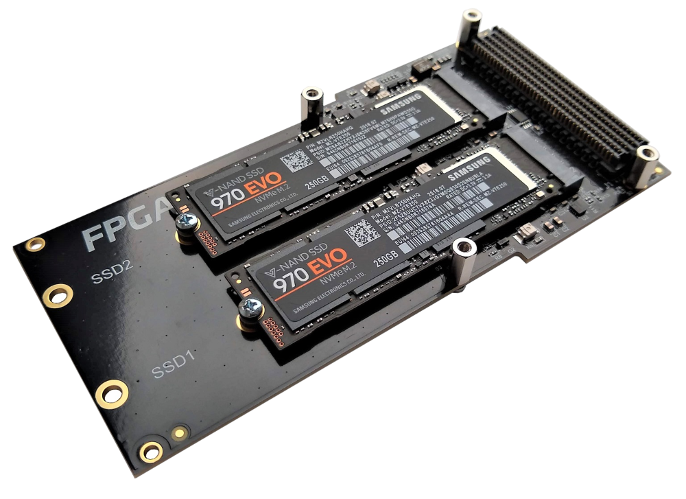
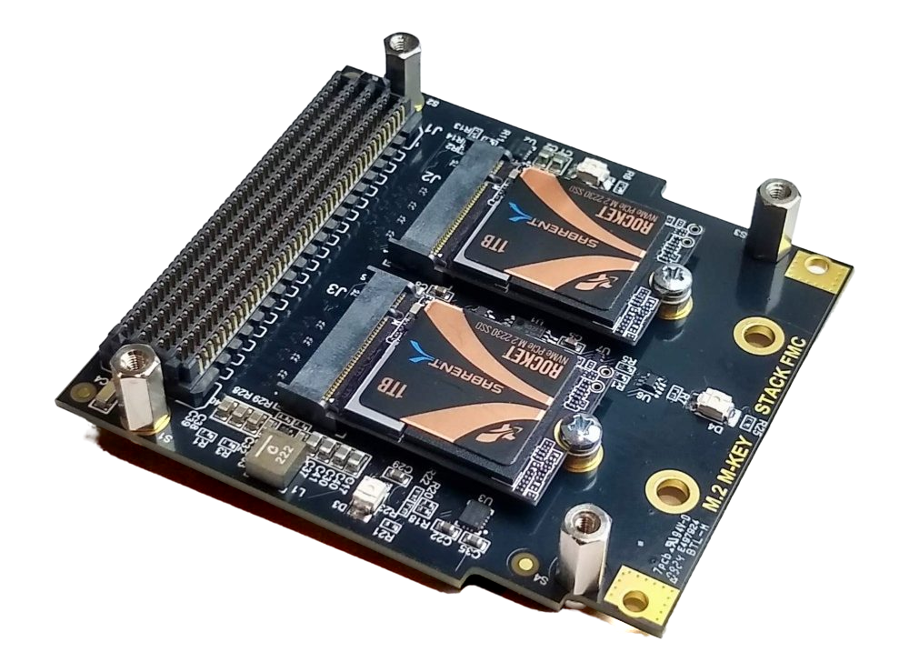

# FPGA Drive FMC Reference Designs

## Description

This repository provides example designs for connecting NVMe SSDs and other M.2 M-key modules to various FPGA, MPSoC,
and ACAP evaluation boards. These designs are compatible with both standalone and PetaLinux environments, and all scripts
and code are provided for building these environments. The interface between the evaluation board and M.2 modules is 
facilitated by Opsero's [FPGA Drive FMC Gen4] (OP063) and [M.2 M-key Stack FMC] (OP073) mezzanine cards, either of which can be used with
these designs.

| FPGA Drive FMC Gen4 | M.2 M-key Stack FMC |
|---------------------|---------------------|
|  |  |

Important links:

* Datasheet for the [FPGA Drive FMC Gen4]
* Datasheet for the [M.2 M-key Stack FMC]
* The user guide for these reference designs is hosted here: [Ref design for FPGA Drive FMC docs](https://refdesign.fpgadrive.com "Ref design for FPGA Drive FMC docs")
* To report a bug: [Report an issue](https://github.com/fpgadeveloper/fpga-drive-aximm-pcie/issues "Report an issue").
* For technical support: [Contact Opsero](https://opsero.com/contact-us "Contact Opsero").

## Requirements

This project is designed for version 2025.2 of the Xilinx tools (Vivado/Vitis/PetaLinux). 
If you are using an older version of the Xilinx tools, then refer to the 
[release tags](https://github.com/fpgadeveloper/fpga-drive-aximm-pcie/tags "releases")
to find the version of this repository that matches your version of the tools.

In order to test this design on hardware, you will need the following:

* Vivado 2025.2
* Vitis 2025.2
* PetaLinux Tools 2025.2
* [FPGA Drive FMC Gen4] or [M.2 M-key Stack FMC]
* M.2 NVMe PCIe Solid State Drive
* One of the supported carriers listed below

## Target designs

This repo contains several designs that target various supported development boards and their
FMC connectors. The table below lists the target design name, the M2 ports supported by the design and 
the FMC connector on which to connect the mezzanine card. Some of the target designs
require a license to generate a bitstream with the AMD Xilinx tools.

<!-- updater start -->
### FPGA designs

| Target board          | Target design   | M2 Slot 1<br> PCIe Lanes | M2 Slot 2<br> PCIe Lanes | FMC Slot    | Standalone | PetaLinux | Yocto | Vivado<br> Edition | IP<br>License |
|-----------------------|-----------------|--------------------------|--------------------------|-------------|-------|-------|-------|-------|-------|
| [KC705]               | `kc705_hpc`     | 4     | -     | HPC         | :white_check_mark: | :x:         | :x:         | Enterprise | -     |
| [KC705]               | `kc705_lpc`     | 1     | -     | LPC         | :white_check_mark: | :x:         | :x:         | Enterprise | -     |
| [KCU105]              | `kcu105_hpc`    | 4     | 4     | HPC         | :white_check_mark: | :x:         | :x:         | Enterprise | -     |
| [KCU105]              | `kcu105_lpc`    | 1     | -     | LPC         | :white_check_mark: | :x:         | :x:         | Enterprise | -     |
| [VC707]               | `vc707_hpc1`    | 4     | -     | HPC1        | :white_check_mark: | :x:         | :x:         | Enterprise | -     |
| [VC707]               | `vc707_hpc2`    | 4     | -     | HPC2        | :white_check_mark: | :x:         | :x:         | Enterprise | -     |
| [VC709]               | `vc709_hpc`     | 4     | -     | HPC         | :white_check_mark: | :x:         | :x:         | Enterprise | -     |
| [VCU118]              | `vcu118`        | 4     | 4     | FMCP        | :white_check_mark: | :x:         | :x:         | Enterprise | -     |

### Zynq-7000 designs

| Target board          | Target design   | M2 Slot 1<br> PCIe Lanes | M2 Slot 2<br> PCIe Lanes | FMC Slot    | Standalone | PetaLinux | Yocto | Vivado<br> Edition | IP<br>License |
|-----------------------|-----------------|--------------------------|--------------------------|-------------|-------|-------|-------|-------|-------|
| [PicoZed 7015]        | `pz_7015`       | 1     | -     | LPC         | :white_check_mark: | :white_check_mark: | :white_check_mark: | Standard :free: | -     |
| [PicoZed 7030]        | `pz_7030`       | 1     | -     | LPC         | :white_check_mark: | :white_check_mark: | :white_check_mark: | Standard :free: | -     |
| [ZC706]               | `zc706_hpc`     | 4     | -     | HPC         | :white_check_mark: | :white_check_mark: | :white_check_mark: | Enterprise | -     |
| [ZC706]               | `zc706_lpc`     | 1     | -     | LPC         | :white_check_mark: | :white_check_mark: | :white_check_mark: | Enterprise | -     |

### Zynq UltraScale+ designs

| Target board          | Target design   | M2 Slot 1<br> PCIe Lanes | M2 Slot 2<br> PCIe Lanes | FMC Slot    | Standalone | PetaLinux | Yocto | Vivado<br> Edition | IP<br>License |
|-----------------------|-----------------|--------------------------|--------------------------|-------------|-------|-------|-------|-------|-------|
| [UltraZed-EV Carrier] | `uzev`          | 4     | 4     | HPC         | :white_check_mark: | :white_check_mark: | :white_check_mark: | Standard :free: | -     |
| [ZCU104]              | `zcu104`        | 1     | -     | LPC         | :white_check_mark: | :white_check_mark: | :white_check_mark: | Standard :free: | -     |
| [ZCU106]              | `zcu106_hpc0`   | 4     | 4     | HPC0        | :white_check_mark: | :white_check_mark: | :white_check_mark: | Standard :free: | -     |
| [ZCU106]              | `zcu106_hpc1`   | 1     | -     | HPC1        | :white_check_mark: | :white_check_mark: | :white_check_mark: | Standard :free: | -     |
| [ZCU111]              | `zcu111`        | 4     | 4     | FMCP        | :white_check_mark: | :white_check_mark: | :white_check_mark: | Enterprise | -     |
| [ZCU208]              | `zcu208`        | 4     | 4     | FMCP        | :white_check_mark: | :white_check_mark: | :white_check_mark: | Enterprise | -     |
| [ZCU216]              | `zcu216`        | 4     | 4     | FMCP        | :white_check_mark: | :white_check_mark: | :white_check_mark: | Enterprise | -     |

### Versal designs

| Target board          | Target design   | M2 Slot 1<br> PCIe Lanes | M2 Slot 2<br> PCIe Lanes | FMC Slot    | Standalone | PetaLinux | Yocto | Vivado<br> Edition | IP<br>License |
|-----------------------|-----------------|--------------------------|--------------------------|-------------|-------|-------|-------|-------|-------|
| [VCK190]              | `vck190_fmcp1`  | 4     | 4     | FMCP1       | :white_check_mark: | :white_check_mark: | :white_check_mark: | Enterprise | -     |
| [VCK190]              | `vck190_fmcp2`  | 4     | 4     | FMCP2       | :white_check_mark: | :white_check_mark: | :white_check_mark: | Enterprise | -     |
| [VHK158]              | `vhk158`        | 4     | -     | FMCP        | :white_check_mark: | :white_check_mark: | :white_check_mark: | Enterprise | -     |
| [VMK180]              | `vmk180_fmcp1`  | 4     | 4     | FMCP1       | :white_check_mark: | :white_check_mark: | :white_check_mark: | Enterprise | -     |
| [VMK180]              | `vmk180_fmcp2`  | 4     | 4     | FMCP2       | :white_check_mark: | :white_check_mark: | :white_check_mark: | Enterprise | -     |
| [VEK280]              | `vek280`        | 4     | 4     | FMCP        | :white_check_mark: | :white_check_mark: | :white_check_mark: | Enterprise | -     |
| [VPK120]              | `vpk120`        | 4     | -     | FMCP        | :white_check_mark: | :white_check_mark: | :white_check_mark: | Enterprise | -     |
| [VPK180]              | `vpk180`        | 4     | -     | FMCP        | :white_check_mark: | :white_check_mark: | :white_check_mark: | Enterprise | -     |

[KC705]: https://www.xilinx.com/kc705
[KCU105]: https://www.xilinx.com/kcu105
[VC707]: https://www.xilinx.com/vc707
[VC709]: https://www.xilinx.com/vc709
[VCU118]: https://www.xilinx.com/vcu118
[PicoZed 7015]: https://www.xilinx.com/products/boards-and-kits/1-hypn9d.html
[PicoZed 7030]: https://www.xilinx.com/products/boards-and-kits/1-hypn9d.html
[ZC706]: https://www.xilinx.com/zc706
[UltraZed-EV Carrier]: https://www.xilinx.com/products/boards-and-kits/1-1s78dxb.html
[ZCU104]: https://www.xilinx.com/zcu104
[ZCU106]: https://www.xilinx.com/zcu106
[ZCU111]: https://www.xilinx.com/zcu111
[ZCU208]: https://www.xilinx.com/zcu208
[ZCU216]: https://www.xilinx.com/zcu216
[VCK190]: https://www.xilinx.com/vck190
[VHK158]: https://www.xilinx.com/vhk158
[VMK180]: https://www.xilinx.com/vmk180
[VEK280]: https://www.xilinx.com/vek280
[VPK120]: https://www.xilinx.com/vpk120
[VPK180]: https://www.xilinx.com/vpk180
<!-- updater end -->

### AUBoard board files

The board definition files for the AUBoard are not currently included in the AMD Xilinx Board Store.
To enable Vivado to recognize this board, the required board files have been included in this
repository as a Git submodule (`submodules/avnet-bdf`), which is a fork of
[Avnet's BDF repository](https://github.com/Avnet/bdf). When cloning this repo, use the `--recursive`
flag to ensure the board files are downloaded:

```
git clone --recursive <repo-url>
```

Notes:

1. The Vivado Edition column indicates which designs are supported by the Vivado *Standard* Edition, the
   FREE edition which can be used without a license. Vivado *Enterprise* Edition requires
   a license however a 30-day evaluation license is available from the AMD Xilinx Licensing site.
2. The [VPK120], [VPK180] and [VHK158] have enough GTs to interface with both M.2 slots, however they have only 2 integrated PCIe blocks
   one of which is on the opposite side of the device with respect to the relevant GT quads, making routing a challenge.
   For this reason these designs supports only 1x M.2 slot.

## Software

These reference designs can be driven by a **standalone** (bare-metal) application or
from within an embedded **Linux** environment. The repository includes all the scripts
and code needed to build either one.

For Linux, two build flows are provided, both based on AMD's 2025.2 tools:

* **PetaLinux** — AMD's long-standing embedded Linux build tool (see the `PetaLinux/`
  directory).
* **Yocto / EDF** — AMD's Embedded Development Framework, the announced successor to
  PetaLinux, built with the `gen-machineconf parse-sdt` flow (see the `Yocto/`
  directory).

> [!IMPORTANT]
> **The PetaLinux flow is being retired for this repository.** Version 2025.2 is the
> last tool release for which we will support PetaLinux; from the next tool version
> onward, Linux images will be built with the Yocto / EDF flow only. New work should
> use the Yocto flow.

For 2025.2, both flows produce an equivalent Linux image with the same applications,
so you can pick whichever fits your workflow. The [target design tables](#target-designs)
show which boards are supported by each flow.

| Environment | Build flow          | Available applications |
|-------------|---------------------|------------------------|
| Standalone  | Vitis               | PCIe enumeration test |
| Linux       | PetaLinux  /  Yocto | Built-in Linux commands<br>Additional tools: mke2fs, badblocks, mount, mkfs, blkid, fdisk, pciutils |

The standalone application reports on the status of the PCIe link and performs
enumeration of the detected PCIe end-points (i.e. the M.2 modules). Under Linux, those
same M.2 SSDs come up as NVMe block devices that you can partition, format and test
with the bundled tools.

## Build instructions

Clone the repo:
```
git clone https://github.com/fpgadeveloper/fpga-drive-aximm-pcie.git
```

Source the AMD tools. All flows need Vivado; the PetaLinux flow needs the PetaLinux
settings, and the Yocto flow needs the Vitis settings (for `xsct`/`sdtgen`):

```
source <path-to-xilinx-tools>/2025.2/Vivado/settings64.sh
source <path-to-petalinux>/2025.2/settings.sh          # for the PetaLinux flow
source <path-to-xilinx-tools>/2025.2/Vitis/settings64.sh   # for the Yocto flow
```

### Cross-platform build runner

All builds are driven by `build.py` at the repo root, on both Windows
(git bash) and Linux. The `build.sh` shim finds a suitable Python 3
automatically (including the one bundled with the AMD tools). Source the
AMD tools first, pick a target label from `./build.sh list`, then use the
command for the thing you want to build — each command builds whatever it
depends on automatically, and skips anything that is already built.
On Windows without git bash, run the same commands from Command Prompt
or PowerShell using `build.bat` (e.g. `build.bat xsa --target <target>`).

#### Build the Vivado project (bitstream + XSA)

```
./build.sh xsa --target <target>
```

#### Build the standalone application

Builds the Vitis workspace and the baremetal boot file (`BOOT.BIN` or
bit file, depending on the device family):

```
./build.sh standalone --target <target>
```

#### Build PetaLinux (Linux only)

```
./build.sh petalinux --target <target>
```

Note: this release supports both PetaLinux and Yocto; PetaLinux will be
dropped in favor of the Yocto flow at the next version update.

#### Build Yocto (Linux only)

```
./build.sh yocto --target <target>
```

#### Build everything

Builds all of the above that the target supports, then gathers the boot
images into `bootimages/*.zip`:

```
./build.sh all --target <target>
./build.sh all --target all          # every target in the repo
```

Also available: `status`, `clean`, `workspace`, `project` — see
`./build.sh --help`. On Windows, the PetaLinux and Yocto stages require a
Linux machine; the runner says so and prints the hand-off command. The
legacy `make` interface still works on Linux (each Makefile now wraps
`build.sh`) but is deprecated and will be removed at the next version
update.

## Troubleshooting

### PetaLinux build fails with `bitbake petalinux-image-minimal failed` and sstate fetch errors

If a `make petalinux TARGET=<board>` run ends with errors like

```
ERROR: <package>-<ver>-r0 do_..._setscene: Fetcher failure: Unable to find file file://.../sstate:...
[ERROR] Command bitbake petalinux-image-minimal failed
```

the actual build is not broken. These `_setscene` errors come from
bitbake trying to pull prebuilt artifacts from the public Xilinx
sstate-cache mirror, which occasionally returns 404 for individual
packages. Bitbake falls back to building those packages locally and
succeeds, but still exits non-zero because of the failed fetches —
so the Makefile stops before the `petalinux-package` step that
produces `BOOT.BIN`.

**Fix: just re-run the same command.** The second attempt finds the
missing packages in the local sstate cache (populated by the first
run) and completes cleanly, producing `BOOT.BIN`. The reference
design itself is fine; this is a transient issue with the public
mirror.


## Contribute

We strongly encourage community contribution to these projects. Please make a pull request if you
would like to share your work:
* if you've spotted and fixed any issues
* if you've added designs for other target platforms
* if you've added software support for other devices

Thank you to everyone who supports us!

## About us

[Opsero Inc.](https://opsero.com "Opsero Inc.") is a team of FPGA developers delivering FPGA products and 
design services to start-ups and tech companies. Follow our blog, 
[FPGA Developer](https://www.fpgadeveloper.com "FPGA Developer"), for news, tutorials and
updates on the awesome projects we work on.

[FPGA Drive FMC Gen4]: https://docs.opsero.com/op063/datasheet/overview/
[M.2 M-key Stack FMC]: https://docs.opsero.com/op073/datasheet/overview/

