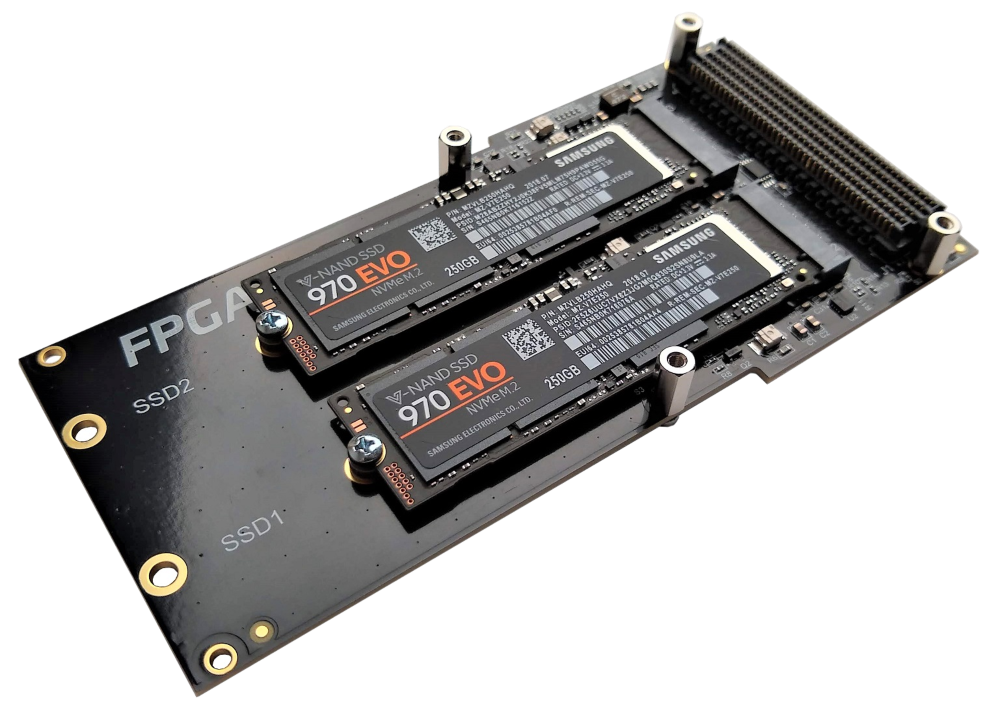
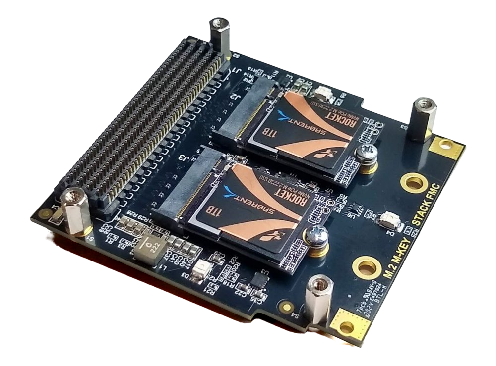

# Description

These are the reference designs for the [FPGA Drive FMC Gen4] and [M.2 M-key Stack FMC] adapters 
that allow connecting NVMe SSDs and other M.2 M-key modules to FPGA, MPSoCs and APACs via the FPGA 
Mezzanine Card (FMC) connector.

Both of the FMC cards shown below can be used with these reference designs.

| FPGA Drive FMC Gen4 | M.2 M-key Stack FMC |
|---|---|
|  |  |

## Hardware Platforms

The hardware designs provided in this reference are based on Vivado and support a range of FPGA, MPSoC and ACAP evaluation
boards. The repository contains all necessary scripts and code to build these designs for the supported platforms listed below:


    
    
        
            
        
    
    
### {{ group.name }} platforms

| Target board        | FMC Slot  Used | Active M.2 Slots | PCIe IP | Standalone  Application | PetaLinux |
|---------------------|---------------|---------|-----|-----|-----|
| [{{ design.board }}]({{ design.link }}) | {{ design.connector }} | {{ design.lanes | length }}x | [{{ design.ip }}]({{ data.ips[design.ip].link }}) |  ✅  ❌  |  ✅  ❌  |




## PCIe IP

These designs implement one PCIe root complex per active M.2 slot. All designs make use of the integrated
PCIe blocks that are built into the FPGA, MPSoC or ACAP device. The PCIe IP core used in each design
depends on the device and is indicated in the "PCIe IP" column in the tables above.

The table below lists the PCIe IP cores used in these designs and provides links to their product pages. As all of these
IP make use of hard PCIe blocks that are integrated into the FPGA/MPSoC/ACAP devices, they do not require a license to
use.

| IP Label       | IP Name     |
|----------------|-------------|
| {{ label }} | [{{ ip.name }}]({{ ip.link }}) |


## Active M.2 Slots

Some of the designs have only one active M.2 slot due to limitations of the target board.
The table below illustrates how to load the M.2 slots for designs that can support only
one M.2 module vs those that can support two.

| One Active Slots | Two Active Slots |
|---|---|
|  |  |

When using designs with only one active slot, you must leave the slot labelled "SLOT 2" or "SSD2" unloaded.

## Software

These reference designs can be driven by either a standalone application or within a PetaLinux environment. 
The repository includes all necessary scripts and code to build both environments. The table 
below outlines the corresponding applications available in each environment:

| Environment      | Available Applications  |
|------------------|-------------------------|
| Standalone       | PCIe enumeration test |
| PetaLinux        | Built-in Linux commands Additional tools: mke2fs, badblocks, mount, mkfs, blkid, fdisk, pciutils |

The standalone software application reports on the status of the PCIe link and 
performs enumeration of the detected PCIe end-points (ie. the M.2 modules).

[FPGA Drive FMC Gen4]: https://www.fpgadrive.com/docs/fpga-drive-fmc-gen4/overview/
[M.2 M-key Stack FMC]: https://www.fpgadrive.com/docs/m2-mkey-stack-fmc/overview/
