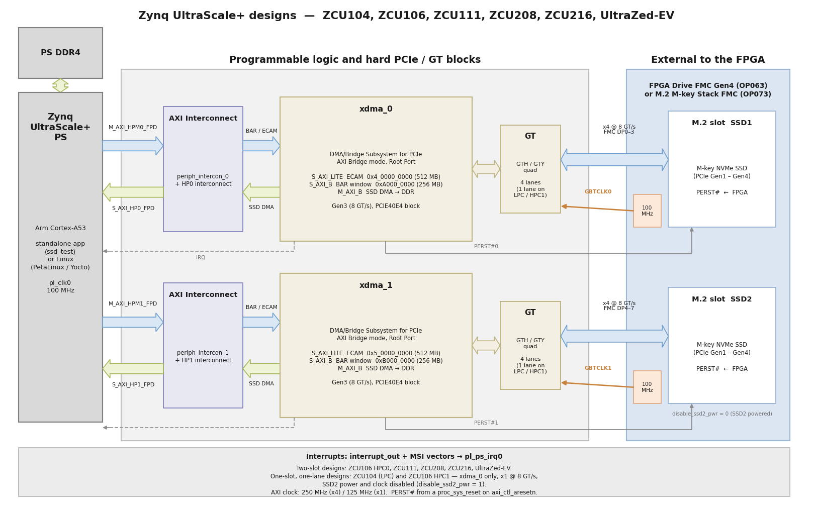
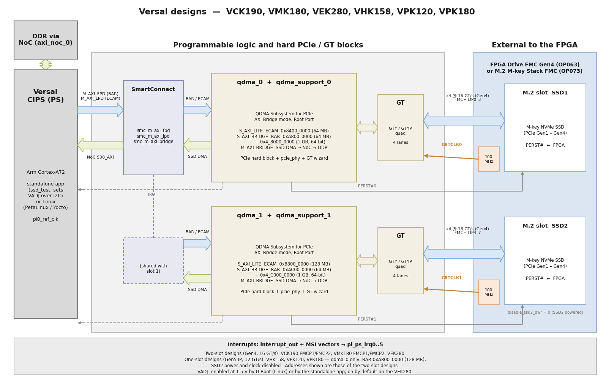
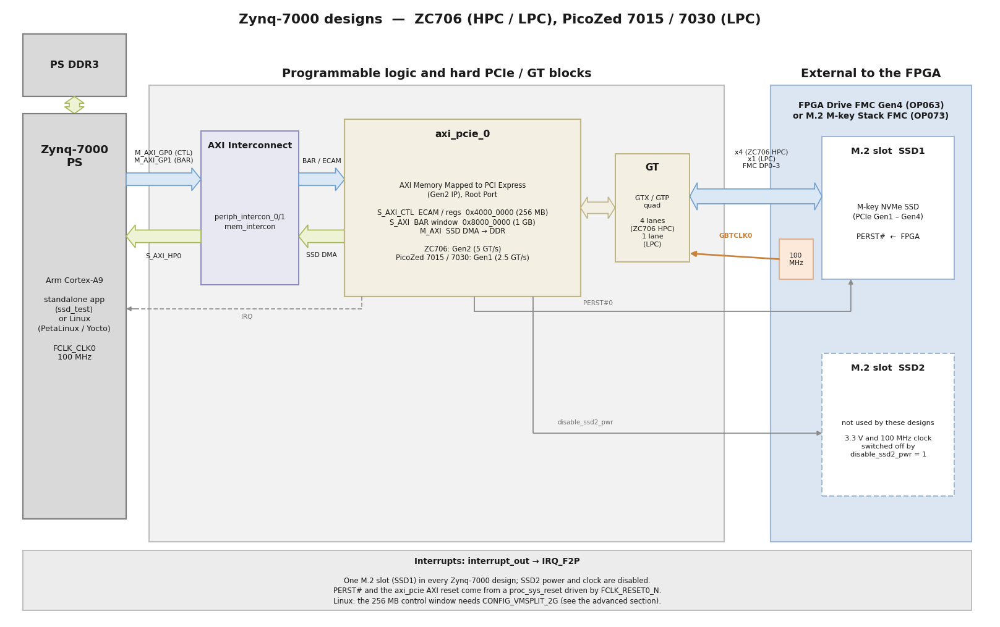
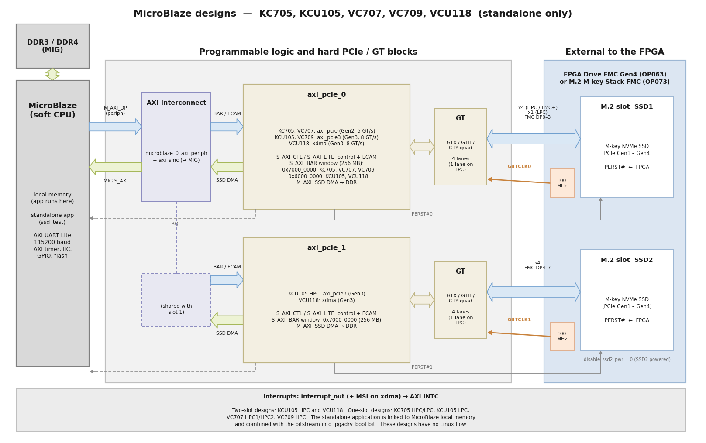

# Hardware design

Every target design in this repository is built around the same idea: **one PCIe Root
Port per active M.2 slot**, implemented with the integrated PCIe block of the device and
bridged to AXI, so that the processor can enumerate the SSD and the SSD can DMA directly
into the processor's DDR memory. The block design is generated by one Tcl script per
device family (`Vivado/src/bd/bd_<family>.tcl`); the GT quad and PCIe block of each target
are selected in `Vivado/src/bd/gt_locs.tcl`, and the pins in
`Vivado/src/constraints/<target>.xdc`.

How to read the diagrams below:

* The **blue arrows** are the processor's accesses into PCIe space: the configuration
  (ECAM) / control-register window of the Root Port and the BAR window through which the
  NVMe driver reaches the SSD's registers.
* The **green arrows** are the SSD's DMA traffic: the Root Port's AXI master writes and
  reads the processor's DDR memory directly (NVMe queues and data buffers).
* Each M.2 slot gets its own 100 MHz reference clock from the FMC card (`GBTCLK0` for
  SSD1, `GBTCLK1` for SSD2) and its own `PERST#` from the FPGA. SSD1 uses the FMC gigabit
  lanes DP0–3, SSD2 uses DP4–7. One-lane designs use DP0 only.
* In the designs with a single active slot, the FPGA drives `disable_ssd2_pwr` high,
  which switches off the 3.3 V supply and the reference clock of the SSD2 slot.

## Zynq UltraScale+ designs

The Root Port is the DMA/Bridge Subsystem for PCI Express (`xdma`) in AXI Bridge mode,
configured for Gen3 (8 GT/s). Its AXI-Lite slave holds the ECAM space and its AXI slave is
the BAR window, both reached from the PS through `M_AXI_HPM0_FPD` (`M_AXI_HPM1_FPD` for
the second slot). Its AXI master reaches DDR through `S_AXI_HP0_FPD` (`S_AXI_HP1_FPD`).
The BAR window must be in the 32-bit address space for the SSD to enumerate correctly
(see the comments in `bd_zynqmp.tcl`).

## Versal designs

The Root Port is the QDMA Subsystem for PCI Express (`qdma`) in AXI Bridge mode, with its
PCIe hard block, PHY and GT wizard in a `qdma_support` hierarchy (derived from AMD's PL
QDMA Root Port example design). The PS reaches the ECAM space through `M_AXI_LPD` and the
BAR windows through `M_AXI_FPD`; the SSD's DMA goes through a SmartConnect into the NoC
and on to the DDR memory controller. The VCK190, VMK180 and VEK280 designs are Gen4
(16 GT/s); the VHK158, VPK120 and VPK180 designs use the Gen5-capable (32 GT/s) blocks of
those devices, and support one M.2 slot (see the notes in the [README](https://github.com/fpgadeveloper/fpga-drive-aximm-pcie#target-designs)).

On the VCK190, VMK180, VPK120 and VPK180, the FMC VADJ supply must be on for the PCIe
link to come up. The Linux images enable VADJ at 1.5 V from U-Boot, and the standalone
application enables it over I2C before it initializes the Root Port. On the VEK280, VADJ
is on by default.

## Zynq-7000 designs

The Root Port is the AXI Memory Mapped to PCI Express IP (`axi_pcie`). The ZC706 and
PicoZed 7030 designs run at Gen2 (5 GT/s); the PicoZed 7015 design runs at Gen1 (2.5 GT/s).
The ZC706 HPC design has four lanes; the ZC706 LPC and PicoZed designs have one lane. All Zynq-7000 designs
support one M.2 slot.

## MicroBlaze designs

The MicroBlaze designs are for the standalone application only. The Root Port is the
AXI Memory Mapped to PCI Express IP (`axi_pcie`, Gen2) on the KC705 and VC707, the AXI
PCI Express Gen3 Subsystem IP (`axi_pcie3`, Gen3) on the KCU105 and VC709, and the
DMA/Bridge Subsystem for PCI Express (`xdma`, Gen3) on the VCU118. The SSD's DMA goes to
the DDR memory through the memory controller (MIG) of the board.

## PCIe link per target

The link that you should see once an SSD is plugged in, assuming the SSD supports at
least that generation and width. A PCIe Gen4 SSD links at the speed of the design (for
example Gen3 x4 on the Zynq UltraScale+ designs), and Linux reports this as a
"downgraded" link; that is expected.

| Target design | Root Port IP | Max. link speed | Lanes per slot | M.2 slots |
|---------------|--------------|-----------------|----------------|-----------|
| `kc705_hpc`, `vc707_hpc1`, `vc707_hpc2` | `axi_pcie` | Gen2, 5 GT/s | x4 | 1 |
| `kc705_lpc` | `axi_pcie` | Gen2, 5 GT/s | x1 | 1 |
| `kcu105_hpc` | `axi_pcie3` | Gen3, 8 GT/s | x4 | 2 |
| `kcu105_lpc` | `axi_pcie3` | Gen3, 8 GT/s | x1 | 1 |
| `vc709_hpc` | `axi_pcie3` | Gen3, 8 GT/s | x4 | 1 |
| `vcu118` | `xdma` | Gen3, 8 GT/s | x4 | 2 |
| `zc706_hpc` | `axi_pcie` | Gen2, 5 GT/s | x4 | 1 |
| `zc706_lpc` | `axi_pcie` | Gen2, 5 GT/s | x1 | 1 |
| `pz_7030` | `axi_pcie` | Gen2, 5 GT/s | x1 | 1 |
| `pz_7015` | `axi_pcie` | Gen1, 2.5 GT/s | x1 | 1 |
| `uzev`, `zcu106_hpc0`, `zcu111`, `zcu208`, `zcu216` | `xdma` | Gen3, 8 GT/s | x4 | 2 |
| `zcu104`, `zcu106_hpc1` | `xdma` | Gen3, 8 GT/s | x1 | 1 |
| `vck190_fmcp1`, `vck190_fmcp2`, `vmk180_fmcp1`, `vmk180_fmcp2`, `vek280` | `qdma` | Gen4, 16 GT/s | x4 | 2 |
| `vhk158`, `vpk120`, `vpk180` | `qdma` | Gen5, 32 GT/s | x4 | 1 |

## Address map

The PCIe windows of a few representative targets, as exported in the XSA. Each Root Port
has its own PCI domain under Linux (`0000:`, `0001:`).

| Target | Root Port | ECAM / control | BAR window(s) |
|--------|-----------|----------------|---------------|
| `zcu106_hpc0` (also all ZynqMP x4) | `xdma_0` | `0x4_0000_0000` (512 MB) | `0xA000_0000` (256 MB) |
|        | `xdma_1` | `0x5_0000_0000` (512 MB) | `0xB000_0000` (256 MB) |
| `zcu104` | `xdma_0` | `0x4_0000_0000` (512 MB) | `0xA000_0000` (256 MB) |
| `vck190_fmcp1` (also VMK180, VEK280) | `qdma_0` | `0x8400_0000` (64 MB) | `0xA800_0000` (64 MB), `0x4_8000_0000` (1 GB) |
|        | `qdma_1` | `0x8800_0000` (128 MB) | `0xAC00_0000` (64 MB), `0x4_C000_0000` (1 GB) |
| `vpk120` | `qdma_0` | `0x9000_0000` (256 MB) | `0xA800_0000` (128 MB), `0x4_8000_0000` (1 GB) |
| `zc706_hpc` (also all Zynq-7000) | `axi_pcie_0` | `0x4000_0000` (256 MB) | `0x8000_0000` (1 GB) |
| `kc705_hpc` | `axi_pcie_0` | `0x1000_0000` (256 MB) | `0x7000_0000` (256 MB) |
| `kcu105_hpc` | `axi_pcie_0` / `axi_pcie_1` | `0x1000_0000` / `0x2000_0000` | `0x6000_0000` / `0x7000_0000` (256 MB each) |

To regenerate the diagrams on this page after a change to the block design, edit and run
`docs/source/images/gen_block_diagram.py` (Python 3 with matplotlib).
