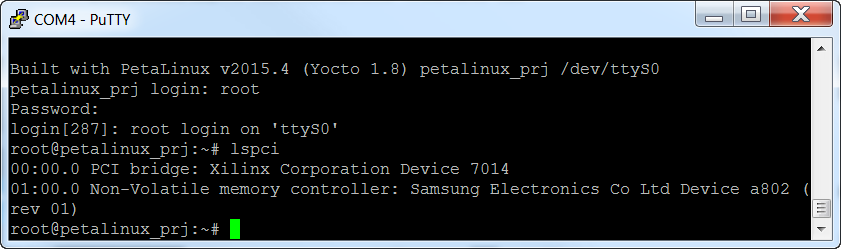
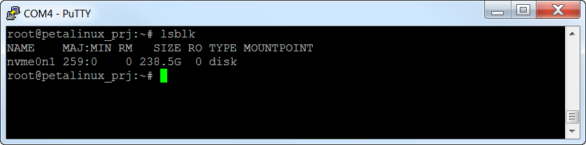
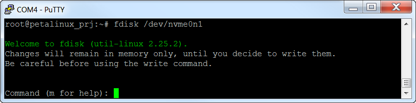
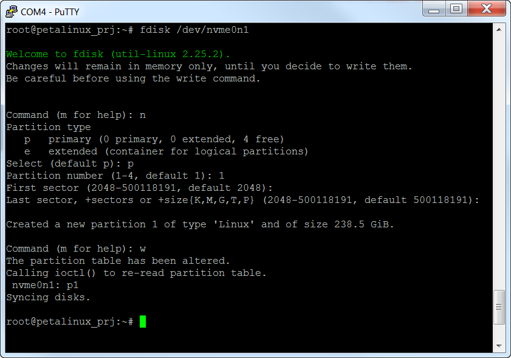
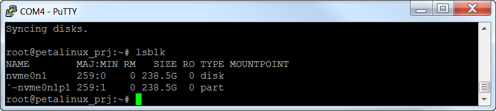
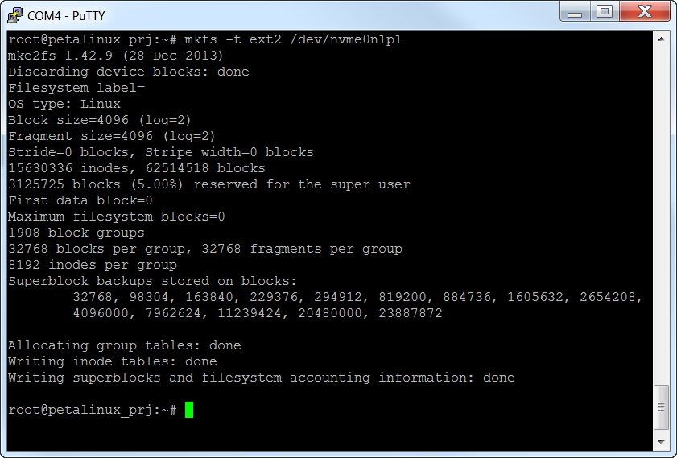
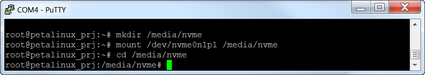

# PetaLinux

PetaLinux can be built for these reference designs by using the Makefile in the `PetaLinux` directory
of the repository.

## Requirements

To build the PetaLinux projects, you will need a physical or virtual machine running one of the 
[supported Linux distributions] as well as the Vitis Core Development Kit installed.

```{attention} You cannot build the PetaLinux projects in the Windows operating system. Windows
users are advised to use a Linux virtual machine to build the PetaLinux projects.
```

## How to build

1. From a command terminal, clone the Git repository and `cd` into it.
   ```
   git clone https://github.com/fpgadeveloper/fpga-drive-aximm-pcie.git
   cd fpga-drive-aximm-pcie
   ```
2. Launch PetaLinux by sourcing the `settings.sh` bash script, eg:
   ```
   source <path-to-installed-petalinux>/settings.sh
   ```
3. Launch Vivado by sourcing the `settings64.sh` bash script, eg:
   ```
   source <vivado-install-dir>/settings64.sh
   ```
4. Build the Vivado and PetaLinux project for your specific target platform by running the following
   commands and replacing `<target>` with one of the following: 
   `kc705_hpc`, 
   `kc705_lpc`, 
   `kcu105_hpc`, 
   `kcu105_hpc_dual`, 
   `kcu105_lpc`, 
   `pz_7015`, 
   `pz_7030`, 
   `uzev_dual`, 
   `vcu118`, 
   `vcu118_dual`, 
   `zc706_hpc`, 
   `zc706_lpc`, 
   `zcu104`, 
   `zcu106_hpc0`, 
   `zcu106_hpc0_dual`, 
   `zcu106_hpc1`, 
   `zcu111`, 
   `zcu111_dual`, 
   `zcu208`, 
   `zcu208_dual`
   ```
   cd PetaLinux
   make petalinux TARGET=<target>
   ```
   
The last command will launch the build process for the corresponding Vivado project if that project
has not already been built and it's hardware exported.

## Boot from SD card

These instructions only apply to the target boards that allow booting from SD card. This includes all
Zynq-7000 boards, Zynq UltraScale+ boards and Zynq RFSoC boards.

### Prepare the SD card

Once the build process is complete, you must prepare the SD card for booting PetaLinux.

1. The SD card must first be prepared with two partitions: one for the boot files and another 
   for the root file system.

   * Plug the SD card into your computer and find it's device name using the `dmesg` command.
     The SD card should be found at the end of the log, and it's device name should be something
     like `/dev/sdX`, where `X` is a letter such as a,b,c,d, etc. Note that you should replace
     the `X` in the following instructions.
     
```{warning} Do not continue these steps until you are certain that you have found the correct
device name for the SD card. If you use the wrong device name in the following steps, you risk
losing data on one of your hard drives.
```
   * Run `fdisk` by typing the command `sudo fdisk /dev/sdX`
   * Make the `boot` partition: typing `n` to create a new partition, then type `p` to make 
     it primary, then use the default partition number and first sector. For the last sector, type 
     `+1G` to allocate 1GB to this partition.
   * Make the `boot` partition bootable by typing `a`
   * Make the `root` partition: typing `n` to create a new partition, then type `p` to make 
     it primary, then use the default partition number, first sector and last sector.
   * Save the partition table by typing `w`
   * Format the `boot` partition (FAT32) by typing `sudo mkfs.vfat -F 32 -n boot /dev/sdX1`
   * Format the `root` partition (ext4) by typing `sudo mkfs.ext4 -L root /dev/sdX2`

2. Copy the following files to the `boot` partition of the SD card:
   Assuming the `boot` partition was mounted to `/media/user/boot`, follow these instructions:
   ```
   $ cd /media/user/boot/
   $ sudo cp /<petalinux-project>/images/linux/BOOT.BIN .
   $ sudo cp /<petalinux-project>/images/linux/boot.scr .
   $ sudo cp /<petalinux-project>/images/linux/image.ub .
   ```

3. Create the root file system by extracting the `rootfs.tar.gz` file to the `root` partition.
   Assuming the `root` partition was mounted to `/media/user/root`, follow these instructions:
   ```
   $ cd /media/user/root/
   $ sudo cp /<petalinux-project>/images/linux/rootfs.tar.gz .
   $ sudo tar xvf rootfs.tar.gz -C .
   $ sync
   ```
   
   Once the `sync` command returns, you will be able to eject the SD card from the machine.

### Boot PetaLinux

1. Plug the SD card into your target board.
2. Ensure that the target board is configured to boot from SD card:
   * **PicoZed:** DIP switch SW1 (on the SoM) is set to 11 (1=ON,2=ON)
   * **ZC706:** DIP switch SW11 must be set to 00110 (1=OFF,2=OFF,3=ON,4=ON,5=OFF)
   * **UltraZed-EV:** DIP switch SW2 (on the SoM) is set to 1000 (1=ON,2=OFF,3=OFF,4=OFF)
   * **ZCU10x:** DIP switch SW6 must be set to 1000 (1=ON,2=OFF,3=OFF,4=OFF)
   * **ZCU111:** DIP switch SW6 must be set to 1000 (1=ON,2=OFF,3=OFF,4=OFF)
   * **ZCU208:** DIP switch SW2 must be set to 1000 (1=ON,2=OFF,3=OFF,4=OFF)
3. Connect one or more M.2 NVMe PCIe SSDs to the [FPGA Drive FMC Gen4]. Connect the 
   [FPGA Drive FMC Gen4] to the FMC connector of the target board.
4. Connect the USB-UART to your PC and then open a UART terminal set to 115200 baud and the 
   comport that corresponds to your target board.
5. Connect and power your hardware.

## Boot via JTAG

```{tip} You need to install the cable drivers before being able to boot via JTAG.
Note that the Vitis installer does not automatically install the cable drivers, it must be done separately.
For instructions, read section 
[installing the cable drivers](https://docs.xilinx.com/r/2022.1-English/ug973-vivado-release-notes-install-license/Installing-Cable-Drivers) 
from the Vivado release notes.
```

```{warning} If you boot the Zynq-7000, Zynq UltraScale+ or Zynq RFSoC designs via JTAG, you must still
first prepare the SD card. The reason is because these designs are configured to use the SD card to store
the root filesystem. If you boot these designs via JTAG without preparing and connecting the SD card, the
boot will hang during at a message similar to this: `Waiting for root device /dev/mmcblk0p2...`
```

### Setup hardware

1. If you are using a Zynq-7000, Zynq UltraScale+ or Zynq RFSoC board, prepare the SD card according 
   to the [instructions above](#prepare-the-sd-card) and plug the SD card into your target board.
2. Ensure that the target board is configured to boot from JTAG:
   * **KC705:** DIP switch SW13 must be set to xx101 (1-2=DONTCARE,3=ON,4=OFF,5=ON)
   * **KCU105:** DIP switch SW15 must be set to xxxx01 (1-4=DONTCARE,5=OFF,6=ON)
   * **VCU118:** DIP switch SW16 must be set to x101 (1=DONTCARE,2=ON,3=OFF,4=ON)
   * **PicoZed:** DIP switch SW1 (on the SoM) is set to 00 (1=OFF,2=OFF)
   * **ZC706:** DIP switch SW11 must be set to 00000 (1=OFF,2=OFF,3=OFF,4=OFF,5=OFF)
   * **UltraZed-EV:** DIP switch SW2 (on the SoM) is set to 1111 (1=ON,2=ON,3=ON,4=ON)
   * **ZCU10x:** DIP switch SW6 must be set to 1111 (1=ON,2=ON,3=ON,4=ON)
   * **ZCU111:** DIP switch SW6 must be set to 1111 (1=ON,2=ON,3=ON,4=ON)
   * **ZCU208:** DIP switch SW2 must be set to 1111 (1=ON,2=ON,3=ON,4=ON)
3. Connect one or more M.2 NVMe PCIe SSDs to the [FPGA Drive FMC Gen4]. Connect the 
   [FPGA Drive FMC Gen4] to the FMC connector of the target board. Instructions for doing this can be 
   found in the [Getting started](https://www.fpgadrive.com/docs/fpga-drive-fmc-gen4/getting-started/) guide.
4. Connect the USB-UART to your PC and then open a UART terminal set to 115200 baud and the 
   comport that corresponds to your target board.
5. Connect and power your hardware.

### Boot PetaLinux

To boot PetaLinux on hardware via JTAG, use the following commands in a Linux command terminal:

1. Change current directory to the PetaLinux project directory for your target design:
   ```
   cd <project-dir>/PetaLinux/<target>
   ```
2. Download bitstream to the FPGA:
   ```
   petalinux-boot --jtag --kernel --fpga
   ```

An explanation of the above command is provided by the `petalinux-boot` command:
```none
For microblaze, it will download the bitstream to target board, and
then boot the kernel image on target board.
For Zynq, it will download the bitstream and FSBL to target board,
and then boot the u-boot and then the kernel on target
board.
For Zynq UltraScale+, it will download the bitstream, PMUFW and FSBL,
and then boot the kernel with help of linux-boot.elf to set kernel
start and dtb addresses.
```

## UART terminal

You will need to setup a terminal emulator to use the PetaLinux command line over the USB-UART connection.
Connect with a baud rate of 115200.

### In Windows

You will need to find the comport for the USB-UART in Windows Device Manager. As a terminal emulator, you
can use the open source and free [Putty](https://www.putty.org/).

### In Linux

In Linux, you can find the USB-UART device by running `dmesg | grep tty`. Typically, the device will be
`/dev/ttyUSB0` or it could be followed by a different number. To open a terminal emulator, you can use
the following command:

```
sudo screen /dev/ttyUSB0 115200
```

## Setup the NVMe SSD in PetaLinux

1. Log into PetaLinux using the username `petalinux`. On the first time you boot, you will be forced to 
   choose a password for this user. The password you choose will be required on all future boots, so choose
   a password that you will remember.
2. Check that the SSD has been enumerated using: `lspci`. Without any arguments, you get the output as shown 
   in the image below. Use the `-vv` argument, to get a more detailed output with the link speed, number of
   lanes used, etc.

   

3. Use lsblk to make sure that the SSD has been recognized as a block device: 
   `lsblk`.

   

4. Run fdisk to create a partition on the SSD: `fdisk /dev/nvme0n1`.

   
   
5. Type these options in fdisk:

    - Type `n` to create a new partition
    - Then type `p`, then `1` to create a new primary partition
    - Use the defaults for the sector numbers
    - Then type `w` to write the data to the disk

   

6. Get the name of the partition created by running `lsblk` again. In the example below, it is `nvme0n1p1`.

   

7. Create a file system on the new partition using: `mkfs -t ext2 /dev/nvme0n1p1`.

   

8. Make a directory to mount the file system to using: `mkdir /media/nvme`.
9. Mount the SSD to that directory: `mount /dev/nvme0n1p1 /media/nvme`.



From this point you will be able to access the SSD from the Linux command line.
The SSD will be mounted to the directory `/media/nvme`. You should be able to copy files to 
that directory, create new files, delete files and use all the disk tools that are available in
the PetaLinux build.


## Kernel Start Address for AXI PCIe Gen3 Subsystem

The AXI PCIe Gen3 Subsystem requires it's CTL0 interface to be allocated 256MB on the address map.
During Linux boot, vmalloc is used to allocate virtual memory for this interface. This repo configures
the Kernel start address to 0xB0000000 from the default 0xC0000000, in order to create sufficient
virtual memory for the CTL0 interface. Without this modification, vmalloc fails during boot.

Find the modification here:

`PetaLinux/src/axi_pcie3/project-spec/meta-user/recipes-kernel/linux/linux-xlnx/kernel-options.cfg`

## Known Issues

### KCU105 Dual design fails to boot when one or both SSDs are not connected

In the case where only one or neither SSD is connected, the PetaLinux boot freezes during the PCIe
enumeration. For example, if we connect SSD1 but not SSD2, PetaLinux boot stops after the following
lines:

```
xilinx-pcie 10000000.axi-pcie: PCIe Link is UP
xilinx-pcie 10000000.axi-pcie: host bridge /amba_pl/axi-pcie@10000000 ranges:
xilinx-pcie 10000000.axi-pcie:   MEM 0x60000000..0x6fffffff -> 0x60000000
xilinx-pcie 10000000.axi-pcie: PCI host bridge to bus 0000:00
pci_bus 0000:00: root bus resource [bus 00-ff]
pci_bus 0000:00: root bus resource [mem 0x60000000-0x6fffffff]
pci 0000:00:00.0: [10ee:8134] type 01 class 0x060400
pci 0000:00:00.0: reg 0x38: [mem 0x00000000-0x000007ff pref]
pci 0000:00:00.0: bridge configuration invalid ([bus 00-00]), reconfiguring
pci 0000:01:00.0: [144d:a808] type 00 class 0x010802
pci 0000:01:00.0: reg 0x10: [mem 0x00000000-0x00003fff 64bit]
pci_bus 0000:01: busn_res: [bus 01-ff] end is updated to 01
pci 0000:00:00.0: BAR 8: assigned [mem 0x60000000-0x600fffff]
pci 0000:00:00.0: BAR 6: assigned [mem 0x60100000-0x601007ff pref]
pci 0000:01:00.0: BAR 0: assigned [mem 0x60000000-0x60003fff 64bit]
pci 0000:00:00.0: PCI bridge to [bus 01]
pci 0000:00:00.0:   bridge window [mem 0x60000000-0x600fffff]
xilinx-pcie 20000000.axi-pcie: PCIe Link is DOWN
xilinx-pcie 20000000.axi-pcie: host bridge /amba_pl/axi-pcie@20000000 ranges:
xilinx-pcie 20000000.axi-pcie:   MEM 0x70000000..0x7fffffff -> 0x70000000
xilinx-pcie 20000000.axi-pcie: PCI host bridge to bus 0001:00
pci_bus 0001:00: root bus resource [bus 00-ff]
pci_bus 0001:00: root bus resource [mem 0x70000000-0x7fffffff]
pci 0001:00:00.0: [10ee:8134] type 01 class 0x060400
```

We suspect that this is caused by a mishandling of the "PCIe Link is DOWN" case by the AXI PCIe
driver. The correct behavior should be that the enumeration is skipped and boot continues when the
down link is detected.

It is worth noting that our ZCU106 Dual design does NOT fail to boot under these conditions,
suggesting that the XDMA driver IS designed to properly handle the "PCIe Link is DOWN" case.
We are still looking for a solution to this issue.

[FPGA Drive FMC Gen4]: https://www.fpgadrive.com/docs/fpga-drive-fmc-gen4/overview/
[supported Linux distributions]: https://docs.xilinx.com/r/2022.1-English/ug1144-petalinux-tools-reference-guide/Setting-Up-Your-Environment

