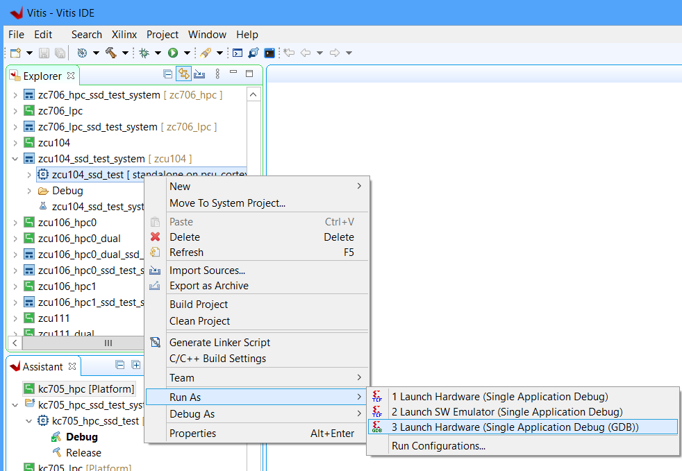

# Stand-alone Application

A stand-alone software application can be built for this project using the build script contained in the 
Vitis subdirectory of this repo. The build script creates a Vitis workspace containing the hardware platform 
(exported from Vivado) and a stand-alone application. The application originates from an example provided by 
Xilinx which is located in the Vitis installation files.
The program demonstrates basic usage of the stand-alone driver including how to check link-up, link speed, 
the number of lanes used, as well as how to perform PCIe enumeration. The original example applications can 
be viewed on the [embeddedsw Github repo](https://github.com/Xilinx/embeddedsw/tree/xlnx_rel_v2025.2):

* For the AXI PCIe designs:
  [xaxipcie_rc_enumerate_example.c](https://github.com/Xilinx/embeddedsw/blob/xlnx_rel_v2025.2/XilinxProcessorIPLib/drivers/axipcie/examples/xaxipcie_rc_enumerate_example.c)
* For the XDMA and QDMA designs:
  [xdmapcie_rc_enumerate_example.c](https://github.com/Xilinx/embeddedsw/blob/xlnx_rel_v2025.2/XilinxProcessorIPLib/drivers/xdmapcie/examples/xdmapcie_rc_enumerate_example.c)

Note that the repo carries lightly modified copies of these examples in
`Vitis/common/src/` (see [advanced](advanced) for the modifications).

## Building the Vitis workspace

To build the Vitis workspace and example application, you must first generate
the Vivado project hardware design (the bitstream) and export the hardware.
Once the bitstream is generated and exported, then you can build the
Vitis workspace using the provided scripts. Follow the instructions appropriate for your
operating system:

* **Windows**: Follow the [build instructions for Windows users](/build_instructions.md#windows-users)
* **Linux**: Follow the [build instructions for Linux users](/build_instructions.md#linux-users)

## Hardware setup

Before running the application, you will need to setup the hardware.

1. Connect one or more SSDs to the mezzanine card and then plug it into the target board.
   Instructions for doing this can be found in the 
   [Getting started](https://www.fpgadrive.com/docs/fpga-drive-fmc-gen4/getting-started/) guide.
2. To receive the UART output of this standalone application, you will need to connect the
   USB-UART of the development board to your PC and run a console program such as 
   [Putty].
   * **For Microblaze designs:** The UART speed must be set to 9600.
   * **For Zynq-7000, Zynq UltraScale+ and Versal designs:** The UART speed must be set to 115200.


## Run the application

You must have followed the build instructions before you can run the application.

1. Launch the Xilinx Vitis GUI.
2. When asked to select the workspace path, select the `Vitis/<target>_workspace` directory.
3. Power up your hardware platform and ensure that the JTAG is connected properly.
4. In the Vitis Explorer panel, double-click on the System project that you want to run -
   this will reveal the application contained in the project. The System project will have 
   the postfix "_system".
5. Now right click on the application "ssd_test" then navigate the
   drop down menu to **Run As->Launch on Hardware (Single Application Debug (GDB)).**.



The run configuration will first program the FPGA with the bitstream, then load and run the 
application. You can view the UART output of the application in a console window and it should
appear as follows:

### Output of XDMA designs

```none
Zynq MP First Stage Boot Loader
Release 2025.2   May 14 2026  -  14:56:34
PMU-FW is not running, certain applications may not be supported.
Interrupts currently enabled are        0
Interrupts currently pending are        0
Interrupts currently enabled are        0
Interrupts currently pending are        0
Link is up
Bus Number is 00
Device Number is 00
Function Number is 00
Port Number is 00
PCIe Local Config Space is   100147 at register CommandStatus
PCIe Local Config Space is    70100 at register Prim Sec. Bus
Root Complex IP Instance has been successfully initialized
xdma_pcie:
PCIeBus is 00
PCIeDev is 00
PCIeFunc is 00
xdma_pcie: Vendor ID is 10EE
Device ID is 9131
xdma_pcie: This is a Bridge
xdma_pcie: bus: 00, device: 00, function: 00: BAR 0 is not implemented
xdma_pcie: bus: 00, device: 00, function: 00: BAR 1 is not implemented
xdma_pcie:
PCIeBus is 01
PCIeDev is 00
PCIeFunc is 00
xdma_pcie: Vendor ID is 144D
Device ID is A80A
xdma_pcie: This is an End Point
xdma_pcie: bus: 01, device: 00, function: 00: BAR 0, ADDR: 0xA1000000 size : 16K
xdma_pcie: bus: 01, device: 00, function: 00: BAR 1required IO space; it is unassigned
xdma_pcie: bus: 01, device: 00, function: 00: BAR 2 is not implemented
xdma_pcie: bus: 01, device: 00, function: 00: BAR 3 is not implemented
xdma_pcie: bus: 01, device: 00, function: 00: BAR 4 is not implemented
xdma_pcie: bus: 01, device: 00, function: 00: BAR 5 is not implemented
xdma_pcie: End Point has been enabled
Successfully ran XdmaPcie rc enumerate Example
```

### Output of AXI PCIe designs

```none
Interrupts currently enabled are        0
Interrupts currently pending are        0
Interrupts currently enabled are        0
Interrupts currently pending are        0
Link is up
Bus Number is 00
Device Number is 00
Function Number is 00
Port Number is 00
PCIe Local Config Space is   100147 at register CommandStatus
PCIe Local Config Space is    70100 at register Prim Sec. Bus
Root Complex IP Instance has been successfully initialized
Start Enumeration of PCIe Fabric on This System
PCIeBus is 00
PCIeDev is 00
PCIeFunc is 00
Vendor ID is 10EE
This is a Bridge
PCIeBus is 01
PCIeDev is 00
PCIeFunc is 00
Vendor ID is 144D
This is an End Point
End Point has been enabled
End of Enumeration of PCIe Fabric on This system
Successfully ran Axipcie rc enumerate Example
```

### Output of the QDMA designs

```none
VADJ: 1.5V enabled successfully
Interrupts currently enabled are        0
Interrupts currently pending are        0
Interrupts currently enabled are        0
Interrupts currently pending are        0
Link is up
Bus Number is 00
Device Number is 00
Function Number is 00
Port Number is 00
PCIe Local Config Space is        0 at register CommandStatus
PCIe Local Config Space is        0 at register Prim Sec. Bus
Root Complex IP Instance has been successfully initialized
xdma_pcie:
PCIeBus is 00
PCIeDev is 00
PCIeFunc is 00
xdma_pcie: Vendor ID is 10EE
Device ID is B048
xdma_pcie: This is a Bridge
xdma_pcie: Requested BAR size of 4292870144K for bus: 00, dev: 00, function: 00 is out of range 
                xdma_pcie:
PCIeBus is 01
PCIeDev is 00
PCIeFunc is 00
xdma_pcie: Vendor ID is 144D
Device ID is A80A
xdma_pcie: This is an End Point
xdma_pcie: bus: 01, device: 00, function: 00: BAR 0, ADDR: 0xA8000000 size : 16K
xdma_pcie: bus: 01, device: 00, function: 00: BAR 1required IO space; it is unassigned
xdma_pcie: bus: 01, device: 00, function: 00: BAR 2 is not implemented
xdma_pcie: bus: 01, device: 00, function: 00: BAR 3 is not implemented
xdma_pcie: bus: 01, device: 00, function: 00: BAR 4 is not implemented
xdma_pcie: bus: 01, device: 00, function: 00: BAR 5 is not implemented
xdma_pcie: End Point has been enabled
Successfully ran XdmaPcie rc enumerate Example
```

## Changing Target Slot

In designs that support two M.2 slots, you can change the target slot by modifying a define value in the
example application. The tables below show the lines to modify and their potential values.

|  | AXI PCIe designs | XDMA and QDMA designs |
|--|------------------|-----------------------|
| **File to modify** | `xaxipcie_rc_enumerate_example.c` | `xdmapcie_rc_enumerate_example.c` |
| **Define** | XPAR_XAXIPCIE_0_BASEADDR | XPAR_XXDMAPCIE_0_BASEADDR |
| **M.2 Slot 1** | XPAR_XAXIPCIE_0_BASEADDR | XPAR_XXDMAPCIE_0_BASEADDR |
| **M.2 Slot 2** | XPAR_XAXIPCIE_1_BASEADDR | XPAR_XXDMAPCIE_1_BASEADDR |

## Advanced Design Details

### Linker script modifications for MicroBlaze designs

For the MicroBlaze designs, the Vitis linker script generator may assign sections across
multiple memory regions. To ensure the application runs correctly, the Vitis build script
modifies the generated linker script and reassigns all sections to local memory.

If you want to manually create an application in the Vitis for one of the MicroBlaze designs,
you will have to manually modify the automatically generated linker script, and set all sections
to local memory.

### axipcie driver

This project uses a modified version of the axipcie driver.

The `axipcie_v3_4` driver is used by designs that use the AXI Memory Mapped to PCIe IP (axi_pcie) and
designs that use the AXI PCIe Gen3 IP (axi_pcie3). However, the driver's SDT device tree binding file
`axipcie_v3_4/data/axipcie.yaml` only declares the compatible string `xlnx,axi-pcie-host-1.00.a`, which
matches the older AXI Memory Mapped to PCIe IP. It does not include `xlnx,axi-pcie3-3.0`, which is the
compatible string used by the AXI PCIe Gen3 IP in the device tree. As a result, the SDT driver mapping
fails to associate the IP with the axipcie driver, and the BSP is built without the driver.

Our modified version of `axipcie.yaml` adds `xlnx,axi-pcie3-3.0` as a compatible string so that the
driver is correctly included in the BSP for designs that use the AXI PCIe Gen3 IP.

Additionally, the YAML references `xlnx,port-type` for the root complex detection field, but the device
tree uses `xlnx,dev-port-type`. Our patch corrects this so that the `IncludeRootComplex` field in the
config table is populated correctly. However, the device tree value for root port designs is `2` (PCI
Express Root Port), while the driver expects `1` (`XAXIPCIE_IS_RC`). The example application normalizes
any non-zero value to `1` after initialization to satisfy the driver's internal assertions.

### xdmapcie driver

This project uses a modified version of the xdmapcie driver.

The `xdmapcie_v3_1` driver is used by designs that use the QDMA IP. The driver's `CfgInitialize` function
contains hardcoded address values for swapping the ECAM (PCIe config space) and CSR (control/status register)
base addresses. These hardcoded values do not match the address map of this project's designs, causing the
driver to access the wrong address regions. Specifically, local config space reads/writes and PCIe fabric
enumeration fail because the driver's `BaseAddress` and `Ecam` fields point to incorrect locations.

Our modified version of `xdmapcie.c` replaces the hardcoded address swap with a generic swap that uses the
actual values from the configuration table. This ensures the driver works correctly regardless of the
design's address map.

Additionally, the SDT config generator populates the `NpMemBaseAddr` and `PMemBaseAddr` fields with
PCIe-side offsets (zero-based) from the device tree `ranges` property, instead of the CPU-side absolute
addresses needed for BAR assignment. The example application (`xdmapcie_rc_enumerate_example.c`) corrects
these values after driver initialization using the actual addresses from `xparameters.h`.

### Modifications to the AXI PCIe example application

The AXI PCIe example application (`xaxipcie_rc_enumerate_example.c`) is based on the AMD driver example
with the following modification:

* **IncludeRootComplex normalization** — The SDT device tree property `xlnx,dev-port-type` provides the
  PCI Express port type value (e.g. `2` for Root Port), but the driver's internal assertions expect
  `IncludeRootComplex` to be exactly `1`. The application normalizes any non-zero value to
  `XAXIPCIE_IS_RC` (`1`) after driver initialization to prevent assertion failures.

### Modifications to the QDMA example application

The QDMA example application (`xdmapcie_rc_enumerate_example.c`) is based on the AMD driver example with
the following modifications:

* **VADJ enable** — On most Versal boards (vck190, vmk180, vpk120, vpk180, vhk158), the VADJ supply that
  powers the FMC+ connector I/Os is not enabled by default. Without VADJ, the PCIe link cannot be
  established because the FMC signals are unpowered. The application calls `vadj_enable(VADJ_1V5)` before
  PCIe initialization to configure the board's power controller via I2C. On the vek280, VADJ is enabled
  by default so this call is a no-op.
* **NpMem/PMem address fix** — After driver initialization, the application corrects the non-prefetchable
  and prefetchable memory base addresses using the actual CPU-side addresses from `xparameters.h`
  (`XPAR_QDMA_0_BASEADDR_2` and `XPAR_QDMA_0_BASEADDR_3`). This is needed because the SDT config
  generator populates these fields with PCIe-side offsets instead of absolute addresses, which would
  otherwise cause BARs to be assigned at address 0x0.

[Putty]: https://www.putty.org/
[FPGA Drive FMC Gen4]: https://docs.opsero.com/op063/datasheet/overview/

